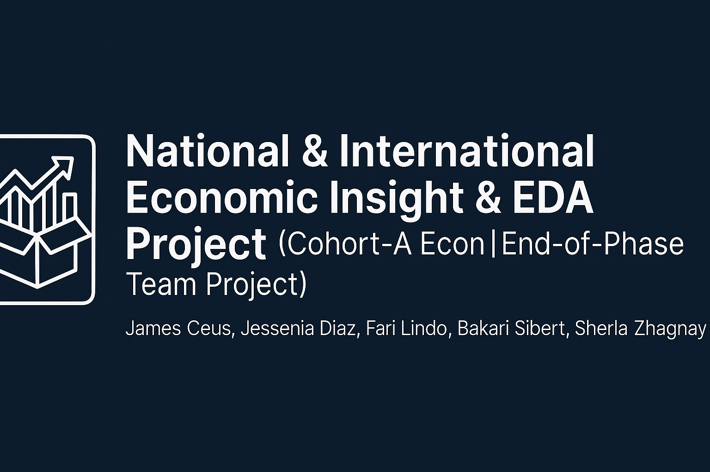

  

---
# 📦 National & International Economic Insight & EDA Project  
## Cohort-A Econ | End-of-Year Team Project  
**Contributors:** James Ceus, Jessenia Diaz, Fari Lindo, Bakari Sibert, Sherla Zhagnay

## **Project Title:** Understanding the Economic Health of Americans and the Broather World 
### **Last Updated:** 2025-05-20  
## **Team Members:** James Ceus, Jessenia Diaz, Fari Lindo, Bakari Sibert, Sherla Zhagnay

---

## 🧠 Project Purpose

This project aims to explore the current and historical economic conditions of the United States and the Broader World through exploratory data analysis (EDA), Statistical Methods, and visualizations.

We are investigating economic **disparities**, **liquidity trends**, **spending behavior**, and **cost of living pressures** on the American population and the Borader World using two main datasets:

- **[Kaggle: Cost of Living & Income Dataset (Extended)](PLACEHOLDER_FOR_LINK)**
- **[US Macro-Micro Index Dataset](PLACEHOLDER_FOR_LINK)** — a monthly panel of key FRED economic indicators

---

## 🔍 Analytical Questions

### ✳️ Group-level Investigative Focus
**What is the overall economic health of Americans and Broder world?**

1. How does income correlate with specific components of the cost of living (e.g., housing affordability, food prices)?
2. How much liquidity do Americans have? 
2. What does disposable income look like over time? Are the regional disparities(eg., North American Region, etc...)?
3. What are people’s spending habits over time — are they spending more or less?
4. How can we use cost of living or expenditure trends to understand the spending behavior of Countries of the world (eg., the cost of housing, food, transportation, etc..)?
5. Are Americans enjoying economic growth, or is there a decline in earnings?
6. Have certain components of the cost of living increased over time, and if so at what rate?

---

## 🔍 Member Contributions

| Member | Questions |
|--------|-----------|
| **James Ceus**     | - How does income correlate with specific components of the cost of living?  - Have some living costs increased faster than income in certain areas? |
| **Jessenia Diaz**  | - How did import/export volumes fluctuate monthly across major East Coast ports in 2024? |
| **Fari Lindo**     | - How are people spending over time?  - How much disposable income do Americans have over time?  - What does the cost of living look like for North Americans? *(Also built the US Macro-Micro Index dataset)* |
| **Bakari Sibert**  | - Are Americans enjoying economic growth, or is there a decline in earnings? |
| **Sherla Zhagnay** | - How can we use cost of living or expenditure trends to understand the spending behavior of Countries of the world (eg., the cost of housing, food, transportation, etc..)? |

---

## 📁 Datasets Used

### 📊 Kaggle Dataset (Primary)

- **Name:** Cost of Living and Income (Extended)
- **Source:** [PLACEHOLDER_KAGGLE_LINK]

### 🧠 Macro-Micro Index Panel (Secondary)

- **Name:** `US_macro_micro_index.csv`
- **Description:** Monthly macro and per-capita economic indicators from 1959–2025
- **Data Source(s):**
    - [FRED: DSPI - Disposable Personal Income](https://fred.stlouisfed.org/series/DSPI)
    - [FRED: A229RX0 - Real Disposable Income Per Capita](https://fred.stlouisfed.org/series/A229RX0)
    - [FRED: PCEC96 - Real Personal Consumption Expenditures](https://fred.stlouisfed.org/series/PCEC96)
    - [FRED: PI - Personal Income](https://fred.stlouisfed.org/series/PI)

---

## 🛠️ Planned Features

- 📈 Time-series analysis with rolling trends
- 📊 Visual EDA to answer each member’s questions
- 📍 Map overlays of regional data (TBD)
- 📑 Final presentation and dashboard with insights

---

## 🔗 External Tools & Resources

- Kaggle: [PLACEHOLDER_KAGGLE_LINK]
- FRED API: [https://fred.stlouisfed.org/docs/api/fred/](https://fred.stlouisfed.org/docs/api/fred/)
- Cost of Living Indexes: [PLACEHOLDER_URL]
- Import/Export Port Stats: [PLACEHOLDER_URL]

---

## 💡 Notes

- All dollar-based figures are inflation-adjusted or noted with nominal units.
- Team members are encouraged to contribute visualizations and summary writeups alongside their EDA.

---

## 👥 Maintainers

This project is part of a collaborative effort by **TKH for TEPP Group Project**.  
Developed by James Ceus, Jessenia Diaz, Fari Lindo, Bakari Sibert, and Sherla Zhagnay.

For questions, please contact: `sherla@email.com` or open an issue in the repo.
